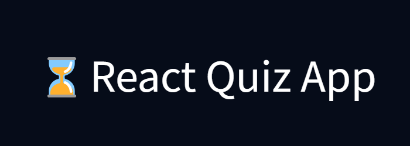
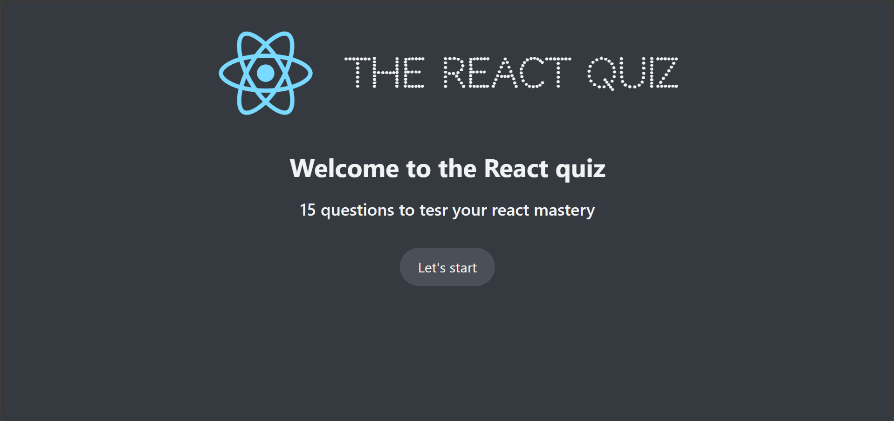
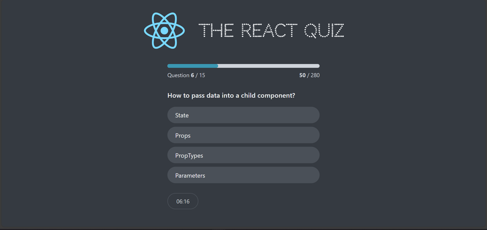
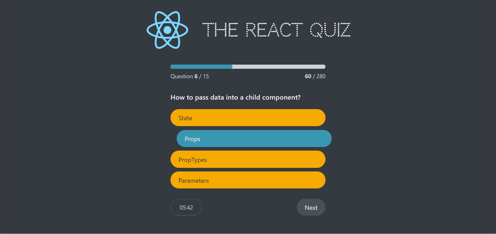
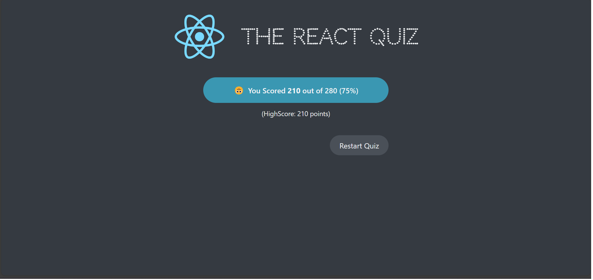

<div align="center">



</div>

## Description

- Simple quiz app using react js ,css,and context api for state management.

## Screenshots








<br/>

## 🛠️ Installation Steps:

<p>1. Clone the repository</p>

```
git clone https://github.com/OmarZahrah/react-quiz-app.git
```

<p>2. Install the required dependencies </p>

```
npm install
```

<p>3. Start the development server</p>

```
npm run server
```

```
npm run dev
```

<br/>
